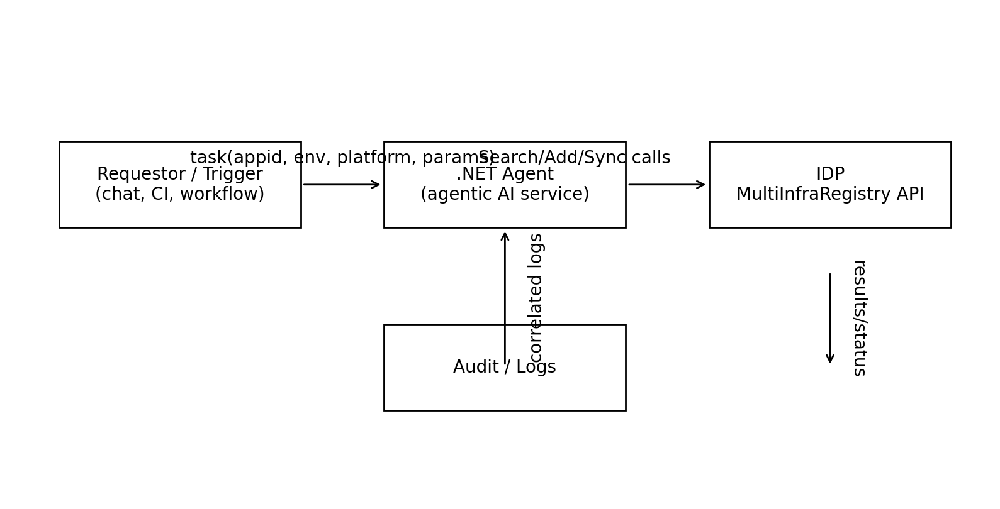
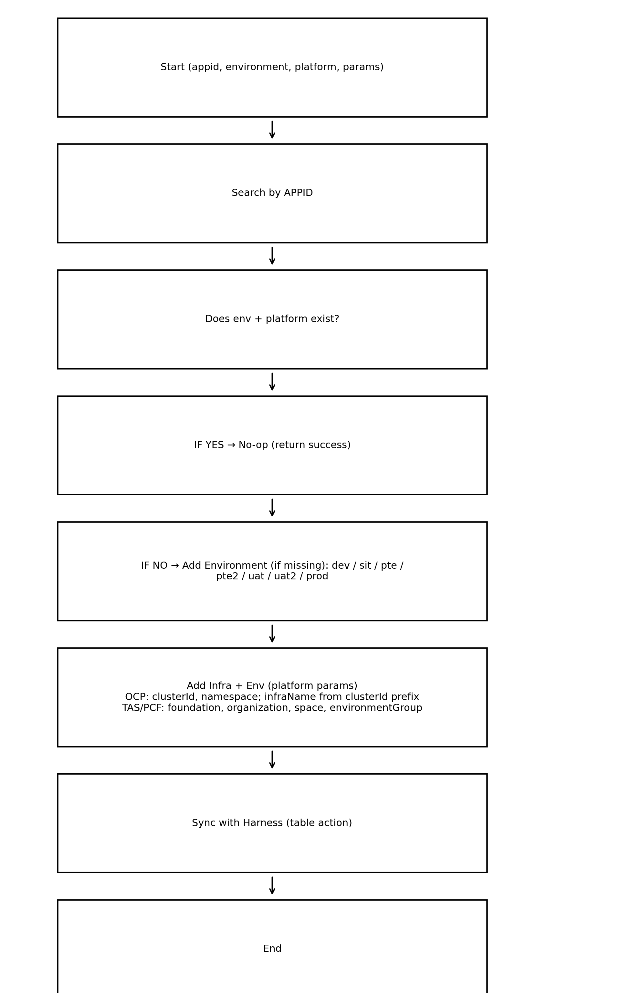

# Agentic AI + IDP MultiInfraRegistry Automation

## Overview

This page documents how a **.NET-based agentic AI framework** automates application **environment** and **infrastructure** operations by invoking the **IDP MultiInfraRegistry** (`developer.wellsfargo.net/#/MultiInfraRegistry`). The automation covers:

- Looking up infrastructure by **APPID** and reading existing registry rows.
- Creating new **Environment** entries (e.g., `dev`, `sit`, `pte`, `pte2`, `uat`, `uat2`, `prod`).
- Creating new **Infrastructure + Environment** combinations with platform-specific attributes.
- Triggering **Sync with Harness** (used for CD) from the registry table action.
- Editing and deleting existing entries via policy-aware automation.

> **Phase 1 Scope**: Prioritize **OCP** and **TAS/PCF** automation. Extend later to **AKS**, **TKGI**, **GCP**, and **VM** variants (Spring Boot, Tomcat), plus additional platform–tooling combinations (e.g., GCP/Azure/OCP/Liquibase/VM).

---

## Features

1. **Search by APPID**
   - The agent calls IDP to locate application registry entries.
   - Returns rows with fields: **Platform**, **Infrastructure Name**, **Environment Name**, **Action**.
   - Platforms shown in UI include **OCP, TAS/PCF, AKS, TKGI, GCP, VM Spring Boot, VM Tomcat**, and more (20+ infra combinations).

2. **Add Environment**
   - At the table level, the agent can add standardized environments: `dev`, `sit`, `pte`, `pte2`, `uat`, `uat2`, `prod`.

3. **Add Infrastructure + Environment Combination**
   - When a specific environment–platform pair is missing, the agent creates it.
   - **OCP**: requires `clusterId`, `namespace`; **infrastructureName** is derived from the **prefix of `clusterId`**.
   - **TAS/PCF**: requires `foundation`, `organization`, `space`, and `environmentGroup`.

4. **Edit/Delete Entries**
   - Existing rows can be updated or removed through policy‑guarded actions.

5. **Sync with Harness**
   - A top-of-table action the agent invokes post-creation/update to ensure CD alignment.

6. **Idempotency & Audit**
   - The agent checks for existing rows before mutating to ensure safe re-runs.
   - All actions are logged with correlation to `appid` and a request id.

> **Registry Fields (per row):** **Platform**, **Infrastructure Name**, **Environment Name**, **Action** (Edit/Delete).

---

## Prerequisites

- **Runtime**: .NET 8 service (agent) with outbound access to IDP endpoints.
- **Auth**: OAuth2 client credentials to access IDP APIs; audit logging enabled.
- **Inputs (common)**: `appid`, `environment`, `platform`.
- **Inputs (OCP)**: `clusterId`, `namespace`; infra name derived from `clusterId` prefix.
- **Inputs (TAS/PCF)**: `foundation`, `organization`, `space`, `environmentGroup`.
- **Change Policy**: Approval to perform add/edit/delete and trigger **Sync with Harness**.
- **Network**: Route from agent to IDP; DNS/MTLS as applicable.

---

## Workflow (Diagrams, not UML)

**System Interaction**  

**Automation Flow**  

---

## Case Studies

### 1) Create missing OCP `dev` environment for existing APPID
**Input**  
`appid=APP-12345`, `platform=OCP`, `environment=dev`, `clusterId=ocp-usw2-prod-a`, `namespace=app-12345-dev`

**Outcome**  
New row present (`Platform=OCP, InfraName=ocp-usw2, EnvName=dev`); sync performed; re-runs no-op.

---

### 2) Ensure PCF `uat` exists; idempotent no-op
**Input**  
`appid=APP-98765`, `platform=TAS/PCF`, `environment=uat`, `foundation=cf-prod-east`, `organization=retail`, `space=app98765-uat`, `environmentGroup=blue`

**Outcome**  
No changes made; optional sync on demand; logged as idempotent success.

---

### 3) APPID not found – controlled failure
**Input**  
`appid=APP-00000`, `platform=OCP`, `environment=sit` (+params)

**Outcome**  
Actionable error: register APPID first or verify identifier.

---

## Assumptions

- The agent uses **.NET 8** and authenticates to IDP via **OAuth2 client credentials**.
- IDP exposes programmatic endpoints for the same actions visible in the MultiInfraRegistry UI, with audit logging.
- Naming standards exist for deriving **Infrastructure Name** from the `clusterId` prefix for OCP.

---

*End of document.*
